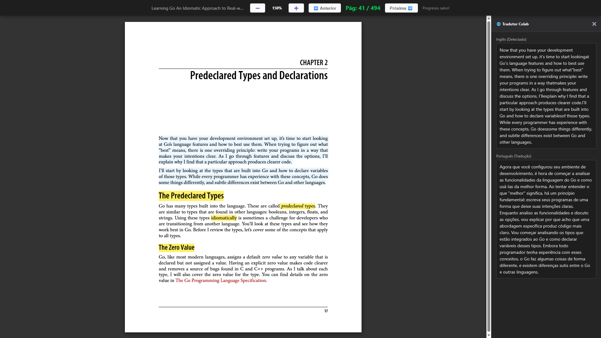
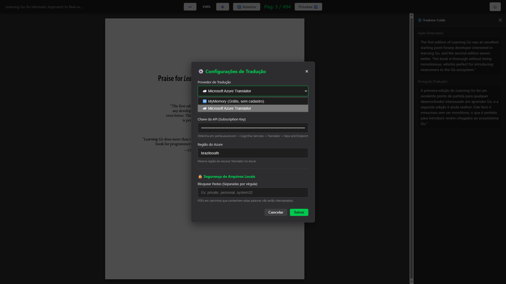

# 📖 Colab PDF Reader & Translator

[](LICENSE)
[](https://chrome.google.com/webstore)
[](https://microsoftedge.microsoft.com/addons)
[](#)
[](https://developer.chrome.com/docs/extensions/mv3/)
[](https://snyk.io/)

<div align="center">
  
</div>

Uma extensão moderna para navegadores baseados em **Chromium** (Microsoft Edge, Google Chrome) desenvolvida com **Manifest V3**. Resolve limitações nativas dos navegadores: impossibilidade de salvar progresso de leitura em PDFs locais (`file:///*`) e falta de ferramentas de tradução integradas.

**Leia com inteligência. Traduza instantaneamente. Nunca perca seu progresso.**

---

## ✨ Funcionalidades

- **🧠 Persistência Inteligente de Estado**
  Salva e retoma automaticamente a última página lida para cada arquivo PDF local usando `chrome.storage.local`, sem depender de sincronização na nuvem.

- **🕵️‍♂️ Interceptação Automática**
  O *Background Service Worker* detecta quando um PDF local é aberto e redireciona instantaneamente para o visualizador customizado.

- **📄 Motor de Renderização 100% Local**
  Utiliza **PDF.js (Mozilla)** compilado localmente para cumprir as rigorosas regras de CSP do Manifest V3, sem depender de CDNs externos ou conexões remotas.

- **🎯 Seleção de Texto Precisa**
  Integração com as propriedades matemáticas do motor Gecko (`--scale-factor` e `pdf_viewer.min.css`) para garantir que clique duplo e seleção de blocos sejam fluidos quanto ao leitor nativo.

- **🔍 Controles de Zoom Dinâmico**
  Escala vetorial sem perda de qualidade, garantindo nitidez em qualquer nível (50% a 300%).

- **🌐 Sidebar de Tradução Desacoplada**
  Painel lateral integrado que captura texto selecionado e traduz instantaneamente usando *Strategy Pattern*, permitindo trocar provedores (MyMemory, Microsoft Azure, Google) sem alterar a lógica core.

- **⚡ Performance Otimizada**
  Renderização baseada em Canvas com sincronização de camadas de texto para máxima responsividade.

---

## 🚀 Início Rápido

### Pré-requisitos

- **Navegador:** Microsoft Edge ou Google Chrome (v90+)
- **Node.js:** Não obrigatório (extensão funciona offline)
- **Espaço em disco:** ~5 MB

### Instalação

#### Método 1: Modo Desenvolvedor (Recomendado para Testes)

1. **Clone ou baixe** este repositório:
   ```bash
   git clone https://github.com/seu-usuario/colab-pdf-reader.git
   cd colab-pdf-reader
   ```

2. **Abra a página de gerenciamento de extensões:**
   - **Chrome:** `chrome://extensions`
   - **Edge:** `edge://extensions`

3. **Ative o "Modo do Desenvolvedor"** (canto superior direito)

4. **Clique em "Carregar expandida" (Load unpacked)** e selecione a pasta do projeto

5. **⚠️ PASSO CRÍTICO:** Clique em "Detalhes" no card da extensão e ative:
   > "Permitir acesso a URLs de arquivo" (**Allow access to file URLs**)

   Sem esta permissão, a extensão não conseguirá ler seus PDFs locais.

6. **Teste:** Arraste qualquer PDF do seu computador para o navegador

#### Método 2: Chrome Web Store (Em Breve)

Versão empacotada estará disponível em breve para instalação com um clique.

---

## 📖 Como Usar

### Abrindo um PDF

1. **Selecione um arquivo PDF** do seu computador
2. **Arraste para o navegador** ou abra normalmente (`Ctrl+O`)
3. A extensão **redireciona automaticamente** para o visualizador customizado

### Navegação

| Ação | Comando |
|------|---------|
| **Próxima página** | Botão `➡️` ou `Seta Direita` |
| **Página anterior** | Botão `⬅️` ou `Seta Esquerda` |
| **Zoom in** | Botão `➕`, `Ctrl +` ou `Ctrl + Scroll` |
| **Zoom out** | Botão `➖`, `Ctrl -` ou `Ctrl + Scroll` |
| **Traduzir texto** | Selecione o texto (abre sidebar automaticamente) |
| **Fechar tradução** | Clique em `✖` no painel |

### Exemplo de Fluxo

```
1. Abra um PDF (ex: documento_tecnico.pdf)
2. A extensão lembra a página anterior automaticamente
3. Selecione um parágrafo em inglês
4. Sidebar abre com tradução em português
5. Próxima sessão: mesma página esperando você
```

---

## 🏗️ Arquitetura

### Estrutura de Arquivos

```
colab-pdf-reader/
│
├── assets                     # Configuração de assets
├── manifest.json              # Configuração do Manifest V3
├── background.js              # Service Worker (interceptação de rotas)
├── viewer.html                # Interface principal
├── viewer.js                  # Lógica core (renderização, zoom, storage)
├── config.js                  # Configuração de dados sensíveis (API-KEY)
├── config_example.js          # Arquivo modelo para transformar em config.js
├── icon16.png                 # Icon16  pre-set
├── icon48.png                 # Icon48  pre-set
├── icon128.png                # Icon128 pre-set
├── icon150.png                # Icon150 pre-set

│
├── pdf.min.js                 # PDF.js Core (Mozilla)
├── pdf.worker.min.js          # Worker assíncrono do PDF.js
├── pdf_viewer.min.css         # Calibração de malha de texto
│
├── README.md                  # Este arquivo
├── LICENSE                    # Licença MIT
├── .webextignore              # Arquivos ignorados no Web-Ext Build
└── .gitignore                 # Arquivos ignorados no Git
```

## 🛡️ Segurança (DevSecOps)
Este projeto foi escaneado e validado utilizando o **Snyk** (Static Application Security Testing). 
- **Zero Vulnerabilidades:** O código local (`viewer.js` e `background.js`) passou nas validações de segurança, garantindo que não há caminhos vulneráveis ou brechas de injeção de script (XSS).
- **Isolamento Total:** Por rodar 100% localmente via Manifest V3 e não possuir dependências externas ativas rodando em background, a extensão mantém a privacidade e a integridade dos seus PDFs locais.

### Fluxo de Dados

```
┌──────────────────┐
│  PDF Local       │
│  (file:///*)     │
└────────┬─────────┘
         │
         ▼
┌──────────────────────────────┐
│  background.js               │
│  (Service Worker)            │
│  ↳ Detecta PDF               │
│  ↳ Redireciona para viewer   │
└────────┬─────────────────────┘
         │
         ▼
┌─────────────────────────────────┐
│  viewer.html + viewer.js        │
│  ├─ Canvas (Renderização)       │
│  ├─ TextLayer (Seleção)         │
│  ├─ Toolbar (Controles)         │
│  └─ Sidebar (Tradução)          │
└────────┬────────────────────────┘
         │
         ▼
┌──────────────────────────┐
│ chrome.storage.local     │
│ (Persistência de Página) │
└──────────────────────────┘
         │
         ▼
┌──────────────────────────┐
│ Translation API          │
│ (MyMemory/Azure/Google)  │
└──────────────────────────┘
```

### Padrões de Design

#### 1. Strategy Pattern (Tradução)

```javascript
class TranslatorService {
    constructor(provider = 'mymemory') {
        this.provider = provider;
    }
    
    async translate(text, sourceLang = 'en', targetLang = 'pt-br') {
        switch(this.provider) {
            case 'mymemory':
                return await this.useMyMemoryAPI(text, sourceLang, targetLang);
            case 'microsoft':
                return await this.useMicrosoftAPI(text, sourceLang, targetLang);
            case 'google':
                return await this.useGoogleAPI(text, sourceLang, targetLang);
        }
    }
}
```

**Benefício:** Trocar de provedor sem alterar a lógica principal.

#### 2. Service Worker Pattern (Interceptação)

```javascript
// background.js
chrome.tabs.onUpdated.addListener((tabId, changeInfo, tab) => {
    if (changeInfo.url?.endsWith('.pdf')) {
        // Redireciona para viewer customizado
    }
});
```

#### 3. Local Storage Pattern (Persistência)

```javascript
// Salva página após renderização
chrome.storage.local.set({ [BOOK_ID]: currentPage });

// Recupera página na próxima abertura
chrome.storage.local.get([BOOK_ID], (res) => {
    currentPage = res[BOOK_ID] || 1;
});
```

---

## 🔧 Configuração Técnica

### 🔑 Configurando a API de Tradução

A extensão vem configurada por padrão com o provedor **MyMemory**, que é gratuito e não requer cadastro, ideal para traduções rápidas e curtas. Para uso contínuo, textos longos ou livros inteiros, recomendamos utilizar o **Microsoft Azure Translator**.

A configuração é feita de forma **100% visual e segura** diretamente na interface da extensão. Suas chaves nunca tocam nenhum arquivo do projeto; elas são criptografadas e salvas apenas no armazenamento local do seu próprio navegador (`chrome.storage.local`), garantindo total privacidade.

**Passo a passo para configurar:**
1. Abra qualquer arquivo PDF na extensão.
2. Clique no ícone de **engrenagem (⚙️)** localizado no canto superior direito da barra de ferramentas.
3. No campo "Provedor de Tradução", selecione **Microsoft Azure Translator**.
4. Insira a sua **Chave da API (Subscription Key)** e a **Região do Azure** (ex: `brazilsouth`).
5. Clique no botão **Salvar**. A chave será injetada automaticamente nas próximas traduções.

<div align="center">
  
</div>

*Nota para Desenvolvedores:* O uso do arquivo físico `config.js` para inserir chaves foi descontinuado para o usuário final, servindo agora apenas como fallback opcional para ambiente de desenvolvimento local.

### 🔑 Configurando a API de Tradução (MODO DEV) (Microsoft Azure)

Para utilizar a tradução via Microsoft Azure, você precisará configurar as suas credenciais locais:

1. Na raiz do projeto, localize o arquivo `config.example.js`.
2. Faça uma cópia deste arquivo e renomeie a cópia para `config.js`.
3. Abra o `config.js` e insira a sua **Key 1** e **Region** obtidas no portal do Azure.
4. *Nota de segurança: O arquivo `config.js` já está listado no `.gitignore` e não será enviado aos seus commits públicos.*

Se preferir testar sem criar uma conta no Azure, abra o arquivo `viewer.js`, localize a linha `const translator = new TranslatorService('microsoft');` (próxima à linha 91) e altere a palavra `'microsoft'` para `'mymemory'`.

### Dependências

| Biblioteca | Versão | Propósito |
|-----------|--------|----------|
| **PDF.js** | 3.11.174 | Renderização de PDFs |
| **Manifest V3** | 3 | Padrão de extensão moderna |

### 🛠️ Empacotamento (Build)

Se desejar gerar um ficheiro `.zip` pronto para distribuição (limpo de ficheiros de desenvolvimento e configurações locais), utilize a ferramenta `web-ext` via `npx`:

```bash
npx web-ext build --source-dir "." --artifacts-dir "../project-colab-pdf-reader_dist" --ignore-files "config.js" ".webextignore"
```

*Nota: O comando acima ignora automaticamente o seu `config.js` privado e segue as regras definidas no `.webextignore`.*

### Permissões Solicitadas

```json
{
  "permissions": [
    "storage",          // Salvar página lida
    "activeTab",        // Detectar URL ativa
    "contextMenus",     // Menu de contexto
    "tabs"              // Gerenciar abas
  ],
  "host_permissions": [
    "file:///*"         // Acessar PDFs locais
  ]
}
```

### CSP (Content Security Policy)

A extensão segue a política de CSP mais restritiva:
- ✅ Scripts locais permitidos
- ✅ Estilos inline permitidos (com `nonce`)
- ❌ Scripts externos bloqueados
- ❌ Conexões remotas bloqueadas (exceto APIs de tradução explícitas)

---

## 📊 Roadmap

### v1.0.0 (Atual)
- [x] Interceptação automática de PDFs locais
- [x] Persistência de página lida
- [x] Renderização com PDF.js
- [x] Seleção e destaque de texto
- [x] Sidebar de tradução com MyMemory
- [x] Integração com Microsoft Translator (Azure)

NOTA:

### ⚖️ Comparativo e Limites das APIs de Tradução (Notas de Teste)

Durante o desenvolvimento e testes da extensão, documentamos diferenças importantes de performance e limites operacionais entre os provedores integrados. Essa análise ajuda a escolher o melhor provedor para o seu caso de uso:

**1. MyMemory API (Gratuita/Anônima)**
* **Velocidade:** 🚀 Resposta quase instantânea (baixíssima latência).
* **Limite por requisição:** Máximo de **500 caracteres** por seleção. Se o usuário tentar selecionar um texto maior que isso de uma só vez, a API retornará erro ou cortará o texto.
* **Limite diário:** 5.000 caracteres por dia.
* **Cenário Ideal:** Testes de desenvolvimento, traduções esporádicas de palavras isoladas ou frases curtas.

**2. Microsoft Azure (Translator v3 - Tier F0 Free)**
* **Velocidade:** ⏱️ Latência um pouco maior. Demora algumas frações de segundo a mais para retornar a resposta devido ao handshake de autenticação e processamento neural da nuvem da Microsoft.
* **Limite por requisição:** Altíssimo (até 50.000 caracteres por chamada), permitindo selecionar parágrafos inteiros ou páginas completas sem falhas.
* **Limite mensal:** **2.000.000 (2 milhões) de caracteres por mês** no plano gratuito.
* **Cenário Ideal:** Uso contínuo no dia a dia (produção), leitura de documentações densas e livros longos.

### v1.1.0 (Próximo)
- [ ] Atalhos de teclado customizáveis
  - `Ctrl + Shift + T` → Abrir/fechar tradução
  - `Ctrl + [` / `Ctrl + ]` → Zoom in/out
  - `Alt + J` / `Alt + K` → Próxima/anterior página

- [ ] Painel de opções (Options Page)
  - Configurar zoom padrão
  - Escolher idioma alvo
  - Selecionar provedor de tradução

### v1.2.0 (Futuro)
- [ ] Suporte a Google Translate
- [ ] Anotações e highlights persistentes
- [ ] Busca dentro do documento
- [ ] Modo dark/light automático
- [ ] Histórico de documentos recentes

### v2.0.0 (Visão)
- [ ] Suporte a múltiplos idiomas na interface
- [ ] Sincronização entre dispositivos (via Google Drive)
- [ ] API pública para desenvolvedores
- [ ] Integração com ferramentas de IA (Claude, ChatGPT)

---

## 🤝 Contribuindo

Contribuições são bem-vindas! Por favor, siga este processo:

1. **Fork** o repositório
2. **Crie uma branch** para sua feature (`git checkout -b feature/NovaFuncionalidade`)
3. **Commit** suas mudanças (`git commit -m 'Adiciona nova funcionalidade'`)
4. **Push** para a branch (`git push origin feature/NovaFuncionalidade`)
5. **Abra um Pull Request**

### Diretrizes

- Siga o padrão de código existente
- Adicione testes para novas funcionalidades
- Atualize a documentação
- Mantenha commits atômicos e descritivos

---

## 🐛 Reportando Bugs

Encontrou um bug? Abra uma [Issue](https://github.com/seu-usuario/colab-pdf-reader/issues) com:

- **Título claro** do problema
- **Descrição detalhada** (o que aconteceu vs. o que deveria acontecer)
- **Passos para reproduzir**
- **Informações do sistema** (SO, versão do navegador)
- **Screenshots** se aplicável

---

## 📝 Licença

Este projeto está licenciado sob a **MIT License** -

```
MIT License

Copyright (c) 2025 Colab PDF Reader Contributors

Permission is hereby granted, free of charge, to any person obtaining a copy
of this software and associated documentation files (the "Software"), to deal
in the Software without restriction, including without limitation the rights
to use, copy, modify, merge, publish, distribute, sublicense, and/or sell
copies of the Software, and to permit persons to whom the Software is
furnished to do so, subject to the following conditions:

The above copyright notice and this permission notice shall be included in all
copies or substantial portions of the Software.

THE SOFTWARE IS PROVIDED "AS IS", WITHOUT WARRANTY OF ANY KIND, EXPRESS OR
IMPLIED, INCLUDING BUT NOT LIMITED TO THE WARRANTIES OF MERCHANTABILITY,
FITNESS FOR A PARTICULAR PURPOSE AND NONINFRINGEMENT.
```

---

## 👥 Autor

**[Rodrigo Chaves](https://github.com/rodrigochavesoa)**

Desenvolvido como parte do ecosistema de produtividade da **[Ponto Chave Design](https://www.instagram.com/pontochavedesign/)** através do projeto colaborativo **[Colab Developer](https://rodrigochavesoa.github.io/Colab_Developer/)** — uma agência de design inovadora focada em UX, web apps e SaaS.

---

## 🙏 Agradecimentos

- **PDF.js (Mozilla Foundation)** — Motor de renderização poderoso e confiável
- **Comunidade Chromium** — Padrões Manifest V3 e APIs de extensão
- **MyMemory Translation API** — Serviço gratuito de tradução
- **Todos os contribuidores** — que ajudam a melhorar este projeto
- **Comunidade DevHub** — **[DevHub](https://algoritmoecafe.com)** — Comunidade ativa que possibilita a gente trocar ideias e a estimular nossas criatividades sem julgamentos. 

---

## 📞 Suporte

Tem dúvidas ou sugestões?

- 📧 **Contato:** [Colab Developer](https://rodrigochavesoa.github.io/Colab_Developer/#contact)
- 🐙 **GitHub Issues:** [Abra uma issue](https://github.com/seu-usuario/colab-pdf-reader/issues)
- 💬 **Discussões:** [Community Discussions](https://github.com/seu-usuario/colab-pdf-reader/discussions)

---

## 📦 Distribuição

### Instalação via Chrome Web Store
(Em desenvolvimento — em breve disponível para download com um clique)

### Instalação via Microsoft Edge Add-ons
(Em desenvolvimento — em breve disponível para download com um clique)

### 🦊 Suporte ao Mozilla Firefox (Gecko)

A arquitetura principal desta extensão foi otimizada para navegadores baseados em **Chromium** (Google Chrome, Microsoft Edge, Opera, Brave). O ecossistema **Gecko** (Mozilla Firefox) também suporta o Manifest V3, mas exige requisitos de segurança e estruturais ligeiramente diferentes.

Se deseja compilar e instalar esta extensão no Firefox, será necessário criar um pacote separado e fazer 3 pequenos ajustes no ficheiro `manifest.json`:

**1. Adicionar o Fallback no Background**
O Firefox exige que o `service_worker` tenha um fallback explícito usando a propriedade `scripts`.
```json
  "background": {
    "service_worker": "background.js",
    "type": "module",
    "scripts": ["background.js"] // Obrigatório apenas no Firefox
  }


2. Adicionar o ID da Extensão (Gecko ID)
A loja da Mozilla não aceita extensões Manifest V3 sem um ID explícito declarado. Adicione o seguinte bloco na raiz do manifesto:

"browser_specific_settings": {
    "gecko": {
      "id": "colab-pdf-viewer@pontochavedesign.com",
      "strict_min_version": "109.0"
    }
  }

3. Política de Segurança (CSP)
A extensão utiliza Web Workers (pdf.worker.min.js) que podem ser interpretados de forma diferente pelo Firefox. Certifique-se de que a sua política de CSP no manifest.json se mantém estrita e sem o valor blob: (que é proibido no Chromium). A configuração abaixo costuma ser universalmente aceite:

"content_security_policy": {
    "extension_pages": "script-src 'self' 'wasm-unsafe-eval'; object-src 'self'; worker-src 'self'"
  }

Dica de Desenvolvimento:
Recomendamos manter uma pasta separada (ex: project_firefox_dist) exclusivamente para a compilação desta versão, isolando-a do ficheiro .zip gerado para o Chrome e Edge.

NOTE : 

4. Opera, Brave e Vivaldi (Ecossistema Chromium):
Não precisa de alterar nada.
O Opera e estes outros navegadores partilham exatamente o mesmo motor base do Chrome e do Edge. Isto significa que o ficheiro .zip que acabou de gerar (sem o blob: e sem o fallback de scripts) vai funcionar na perfeição na loja de extensões do Opera. As regras rígidas de segurança aplicam-se igualmente a todos eles.
---

**Desenvolvido com carinho para leitores, pesquisadores e desenvolvedores que entendem o valor da produtividade.**

---

*Última atualização: June 2025*
*Versão: 1.0.0*
